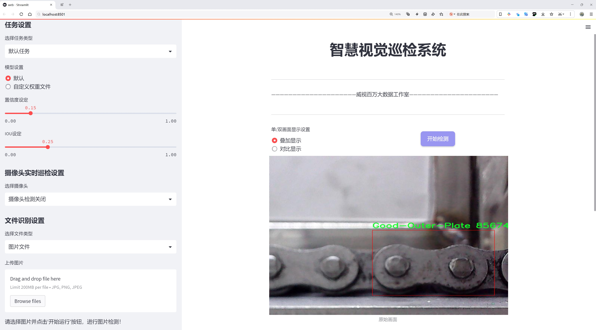
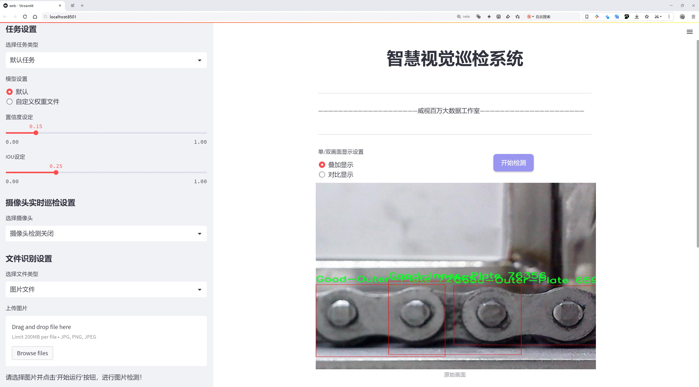
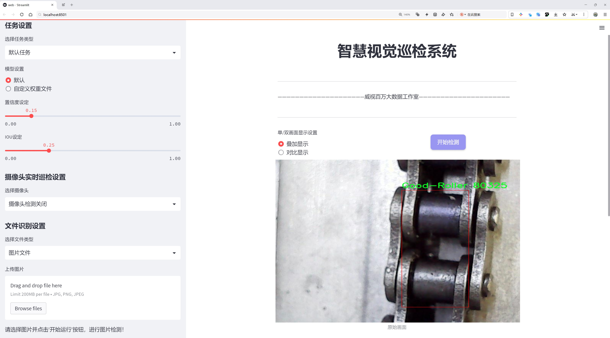
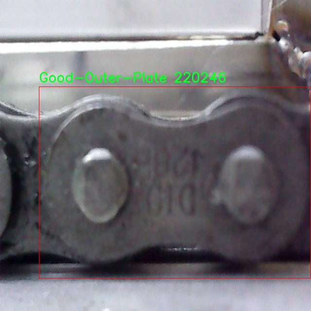
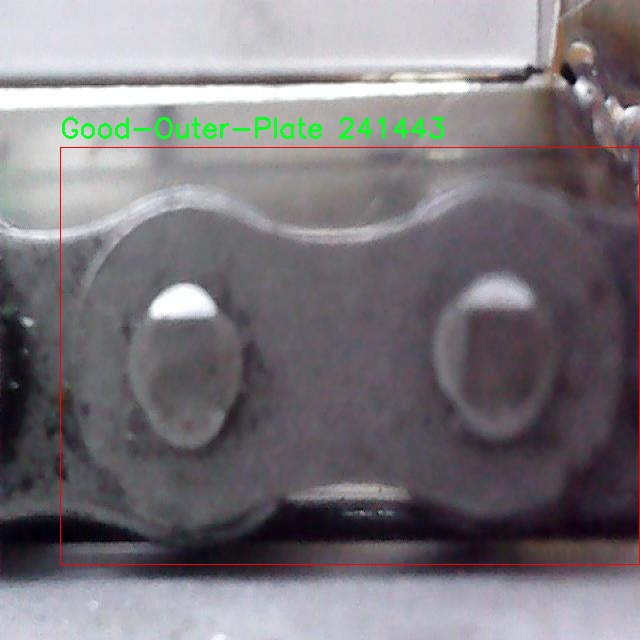
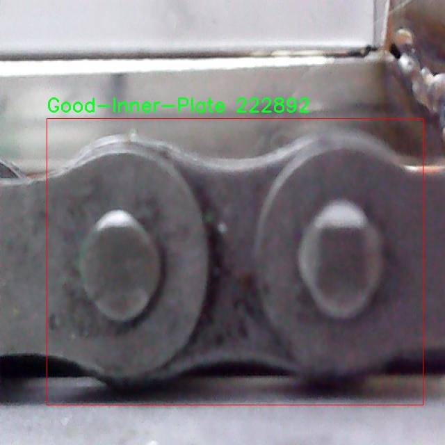
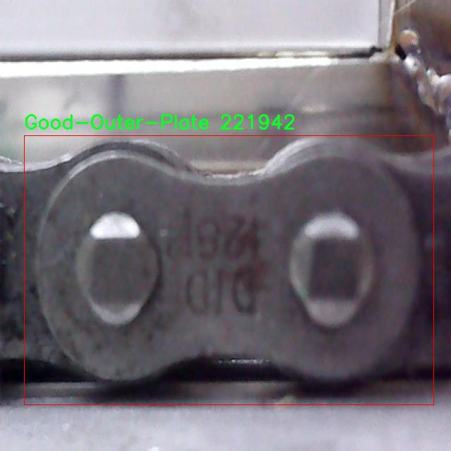
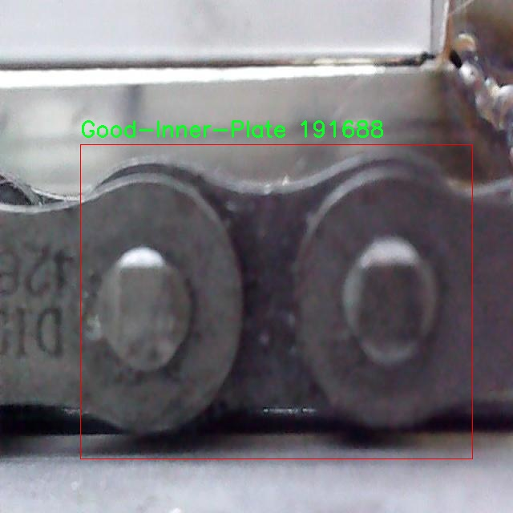

# 链条缺陷检测检测系统源码分享
 # [一条龙教学YOLOV8标注好的数据集一键训练_70+全套改进创新点发刊_Web前端展示]

### 1.研究背景与意义

项目参考[AAAI Association for the Advancement of Artificial Intelligence](https://gitee.com/qunshansj/projects)

项目来源[AACV Association for the Advancement of Computer Vision](https://gitee.com/qunmasj/projects)

研究背景与意义

随着工业自动化和智能制造的迅速发展，链条作为机械传动系统中不可或缺的组成部分，其质量直接影响到设备的运行效率和安全性。链条的缺陷不仅会导致设备的故障，还可能引发严重的安全事故。因此，及时、准确地检测链条缺陷成为了工业生产中亟待解决的问题。传统的链条缺陷检测方法多依赖人工视觉检查，这种方法不仅效率低下，而且容易受到人为因素的影响，导致漏检或误检的情况发生。为了解决这一问题，基于计算机视觉和深度学习的自动化检测系统逐渐成为研究的热点。

YOLO（You Only Look Once）系列算法因其高效的实时目标检测能力而受到广泛关注。YOLOv8作为该系列的最新版本，在目标检测精度和速度上均有显著提升。通过对YOLOv8算法的改进，可以进一步提高链条缺陷检测的准确性和效率。本研究旨在基于改进的YOLOv8算法，构建一个高效的链条缺陷检测系统，以满足工业生产对链条质量检测的需求。

本研究所使用的数据集包含2300张图像，涵盖了7个类别，包括“Good-Inner-Plate”、“Good-Outer-Plate”、“Good-Roller”、“No-Roller”、“Not-Good-Inner-Plate”、“Not-Good-Outer-Plate”和“Not-Good-Rivet”。这些类别的划分不仅反映了链条的正常状态和缺陷状态，还为模型的训练提供了丰富的样本数据。通过对这些图像的深度学习训练，模型能够学习到不同类别之间的特征差异，从而实现对链条缺陷的准确识别。

本研究的意义在于，通过改进YOLOv8算法，提升链条缺陷检测的自动化水平，减少人工检测的依赖，降低人力成本。同时，系统的高准确率和实时性将为工业生产提供更为可靠的质量保障。此外，基于深度学习的检测系统具有良好的扩展性，未来可以根据不同的需求，针对其他机械部件的缺陷检测进行相应的模型调整和优化。

在当前全球制造业竞争日益激烈的背景下，提升产品质量和生产效率已成为企业生存和发展的关键。链条作为关键的传动部件，其质量控制尤为重要。通过本研究的实施，不仅可以为链条缺陷检测提供一种新的解决方案，还可以为其他领域的智能检测技术提供借鉴，推动智能制造的进一步发展。

综上所述，基于改进YOLOv8的链条缺陷检测系统的研究，不仅具有重要的理论意义，还具备广泛的应用前景。通过实现高效、准确的链条缺陷检测，将为工业生产的智能化转型提供有力支持，助力制造业的高质量发展。

### 2.图片演示







##### 注意：由于此博客编辑较早，上面“2.图片演示”和“3.视频演示”展示的系统图片或者视频可能为老版本，新版本在老版本的基础上升级如下：（实际效果以升级的新版本为准）

  （1）适配了YOLOV8的“目标检测”模型和“实例分割”模型，通过加载相应的权重（.pt）文件即可自适应加载模型。

  （2）支持“图片识别”、“视频识别”、“摄像头实时识别”三种识别模式。

  （3）支持“图片识别”、“视频识别”、“摄像头实时识别”三种识别结果保存导出，解决手动导出（容易卡顿出现爆内存）存在的问题，识别完自动保存结果并导出到tempDir中。

  （4）支持Web前端系统中的标题、背景图等自定义修改，后面提供修改教程。

  另外本项目提供训练的数据集和训练教程,暂不提供权重文件（best.pt）,需要您按照教程进行训练后实现图片演示和Web前端界面演示的效果。

### 3.视频演示

[3.1 视频演示](https://www.bilibili.com/video/BV1TH48esEM3/)

### 4.数据集信息展示

##### 4.1 本项目数据集详细数据（类别数＆类别名）

nc: 8
names: ['Good-Inner-Plate', 'Good-Outer-Plate', 'Good-Roller', 'No-Roller', 'Not-Good-Inner-Plate', 'Not-Good-Outer-Plate', 'Not-Good-Rivet', 'Rust']


##### 4.2 本项目数据集信息介绍

数据集信息展示

在本研究中，我们使用了名为“Chain”的数据集，以训练和改进YOLOv8的链条缺陷检测系统。该数据集专注于链条组件的质量评估，涵盖了多种类别，旨在提高机器学习模型在实际应用中的准确性和可靠性。数据集包含8个类别，分别为“Good-Inner-Plate”、“Good-Outer-Plate”、“Good-Roller”、“No-Roller”、“Not-Good-Inner-Plate”、“Not-Good-Outer-Plate”、“Not-Good-Rivet”和“Rust”。这些类别不仅反映了链条组件的良好状态，还涵盖了不同类型的缺陷，确保模型能够识别出各种潜在问题。

首先，数据集中“Good-Inner-Plate”和“Good-Outer-Plate”这两个类别代表了链条的良好状态，分别对应于链条内部和外部的结构部件。这些类别的样本为模型提供了正面的学习示例，使其能够理解什么样的特征是合格的。这对于后续的缺陷检测至关重要，因为模型需要有一个清晰的基准来判断何为“好”的链条组件。

其次，“Good-Roller”类别则专注于链条中的滚轮部分，确保在正常工作条件下，滚轮的状态良好。这一类别的样本同样重要，因为滚轮的性能直接影响链条的整体运作效率和寿命。相对而言，“No-Roller”类别则表示缺失的滚轮，这种情况在链条的实际使用中可能会导致严重的功能障碍。因此，能够准确识别出这一缺陷是提升检测系统性能的关键。

在缺陷类别方面，“Not-Good-Inner-Plate”和“Not-Good-Outer-Plate”分别标识了内部和外部结构的缺陷。这些类别的样本帮助模型学习到不同的缺陷特征，如裂纹、变形或其他可能影响链条功能的损伤。同时，“Not-Good-Rivet”类别则专注于链条铆钉的质量问题，铆钉的缺陷可能导致链条连接不牢固，从而影响整体的安全性和稳定性。

最后，“Rust”类别则代表了链条组件的腐蚀问题，生锈不仅会影响链条的美观，更重要的是，它会显著降低链条的使用寿命和性能。因此，能够有效识别生锈现象对于维护链条的正常运作至关重要。

通过对“Chain”数据集的深入分析，我们能够更好地理解各个类别之间的关系及其在链条缺陷检测中的重要性。该数据集不仅为YOLOv8模型的训练提供了丰富的样本，还为模型的评估和优化奠定了基础。随着模型的不断迭代和改进，我们期望能够实现更高的检测精度，从而在实际应用中有效提升链条的维护效率和安全性。通过对这些数据的深入挖掘和分析，我们相信可以推动链条检测技术的发展，为工业生产和设备维护提供更为可靠的解决方案。











### 5.全套项目环境部署视频教程（零基础手把手教学）

[5.1 环境部署教程链接（零基础手把手教学）](https://www.ixigua.com/7404473917358506534?logTag=c807d0cbc21c0ef59de5)


[5.2 安装Python虚拟环境创建和依赖库安装视频教程链接（零基础手把手教学）](https://www.ixigua.com/7404474678003106304?logTag=1f1041108cd1f708b01a)

### 6.手把手YOLOV8训练视频教程（零基础小白有手就能学会）

[6.1 手把手YOLOV8训练视频教程（零基础小白有手就能学会）](https://www.ixigua.com/7404477157818401292?logTag=d31a2dfd1983c9668658)

### 7.70+种全套YOLOV8创新点代码加载调参视频教程（一键加载写好的改进模型的配置文件）

[7.1 70+种全套YOLOV8创新点代码加载调参视频教程（一键加载写好的改进模型的配置文件）](https://www.ixigua.com/7404478314661806627?logTag=29066f8288e3f4eea3a4)

### 8.70+种全套YOLOV8创新点原理讲解（非科班也可以轻松写刊发刊，V10版本正在科研待更新）

由于篇幅限制，每个创新点的具体原理讲解就不一一展开，具体见下列网址中的创新点对应子项目的技术原理博客网址【Blog】：


[8.1 70+种全套YOLOV8创新点原理讲解链接](https://gitee.com/qunmasj/good)

### 9.系统功能展示（检测对象为举例，实际内容以本项目数据集为准）

图9.1.系统支持检测结果表格显示

  图9.2.系统支持置信度和IOU阈值手动调节

  图9.3.系统支持自定义加载权重文件best.pt(需要你通过步骤5中训练获得)

  图9.4.系统支持摄像头实时识别

  图9.5.系统支持图片识别

  图9.6.系统支持视频识别

  图9.7.系统支持识别结果文件自动保存

  图9.8.系统支持Excel导出检测结果数据


### 10.原始YOLOV8算法原理

原始YOLOv8算法原理

YOLOv8是Ultralytics公司在2023年推出的目标检测算法，作为YOLO系列的最新版本，它在前几代的基础上进行了显著的改进与创新。YOLO（You Only Look Once）算法自诞生以来，以其高效的实时检测能力和相对较高的准确性在计算机视觉领域占据了重要地位。YOLOv8不仅延续了这一传统，还通过一系列结构上的优化和新技术的引入，进一步提升了性能和灵活性，使其在目标检测、图像分割和图像分类等任务中表现出色。

YOLOv8的网络结构主要由三个部分组成：主干网络（Backbone）、特征增强网络（Neck）和检测头（Head）。在主干网络方面，YOLOv8参考了YOLOv7中的ELAN模块设计，采用了C2F模块替代了YOLOv5中的C3模块。C2F模块通过并行更多的梯度流分支，确保了在轻量化的同时，能够获取更丰富的梯度信息，从而提升了模型的精度和响应速度。这种设计使得YOLOv8在处理不同尺度的目标时，能够更有效地提取特征，适应复杂的场景。

在特征增强网络中，YOLOv8引入了PAN-FPN（Path Aggregation Network - Feature Pyramid Network）的思想，通过直接连接不同层次的特征图，增强了多尺度特征的融合能力。这种结构使得网络能够更好地捕捉到目标的细节信息，尤其是在目标尺寸变化较大的情况下，能够有效提升检测的准确性。

YOLOv8的检测头部分则是其创新的核心所在。与以往的耦合头（Coupled-Head）不同，YOLOv8采用了解耦头（Decoupled-Head）结构，将目标的分类和边界框回归任务分开处理。通过两个独立的卷积分支，分别进行类别预测和边界框位置预测，YOLOv8能够更专注于每个任务，减少了复杂场景下的定位误差和分类错误。此外，YOLOv8在损失函数的设计上也进行了优化，取消了传统的Obj分支，采用BCELoss（Binary Cross Entropy Loss）和DFL（Distribution Focal Loss）结合CIoULoss（Complete Intersection over Union Loss）的方式，使得模型在训练过程中更快地聚焦于标签附近的区域，提高了预测的精度。

值得一提的是，YOLOv8在目标检测方法上采用了Anchor-free的策略，摒弃了以往基于锚框的检测方式。传统的Anchor-based方法需要预先定义锚框，这不仅增加了模型的复杂性，还在处理不同尺度和形状的目标时显得不够灵活。YOLOv8通过将目标检测转化为关键点检测，直接预测目标的位置和大小，极大地简化了模型的设计，使得网络在训练和推理时都能更高效地运行。这种Anchor-free方法不仅提高了模型的泛化能力，还使得YOLOv8在不同数据集上的应用更加广泛。

在输入处理方面，YOLOv8默认接受640x640的图像尺寸，但在实际应用中，针对不同长宽比的图像，采用自适应缩放策略，以提高检测速度和准确性。通过将图像的长边按比例缩小到指定尺寸，并对短边进行填充，YOLOv8有效减少了信息冗余。此外，在训练过程中，YOLOv8还引入了Mosaic图像增强技术，通过随机拼接多张图像，迫使模型学习不同位置和周围像素的特征，从而提高了模型的鲁棒性和预测精度。

总的来说，YOLOv8的设计理念围绕着快速、准确和易于使用展开，通过引入新的网络结构和训练策略，显著提升了目标检测的性能。其在处理复杂场景、不同尺度目标时的表现，得益于主干网络的优化、特征增强的有效融合以及解耦头的创新设计，使得YOLOv8成为了当前目标检测领域的一个重要里程碑。无论是在学术研究还是实际应用中，YOLOv8都展现出了强大的潜力，能够满足实时检测的需求，并为未来的研究提供了新的方向。


### 11.项目核心源码讲解（再也不用担心看不懂代码逻辑）

#### 11.1 code\ultralytics\models\yolo\segment\train.py

以下是经过简化和注释的核心代码部分，主要保留了 `SegmentationTrainer` 类的关键功能和方法。

```python
# 导入必要的库和模块
from copy import copy
from ultralytics.models import yolo
from ultralytics.nn.tasks import SegmentationModel
from ultralytics.utils import DEFAULT_CFG, RANK
from ultralytics.utils.plotting import plot_images, plot_results

class SegmentationTrainer(yolo.detect.DetectionTrainer):
    """
    扩展 DetectionTrainer 类，用于基于分割模型的训练。
    示例用法：
        trainer = SegmentationTrainer(overrides={'model': 'yolov8n-seg.pt', 'data': 'coco8-seg.yaml', 'epochs': 3})
        trainer.train()
    """

    def __init__(self, cfg=DEFAULT_CFG, overrides=None, _callbacks=None):
        """初始化 SegmentationTrainer 对象，设置配置和覆盖参数。"""
        if overrides is None:
            overrides = {}
        overrides["task"] = "segment"  # 设置任务类型为分割
        super().__init__(cfg, overrides, _callbacks)  # 调用父类构造函数

    def get_model(self, cfg=None, weights=None, verbose=True):
        """返回初始化的 SegmentationModel，使用指定的配置和权重。"""
        # 创建分割模型实例
        model = SegmentationModel(cfg, ch=3, nc=self.data["nc"], verbose=verbose and RANK == -1)
        if weights:
            model.load(weights)  # 如果提供权重，则加载权重

        return model  # 返回模型实例

    def get_validator(self):
        """返回 SegmentationValidator 实例，用于验证 YOLO 模型。"""
        self.loss_names = "box_loss", "seg_loss", "cls_loss", "dfl_loss"  # 定义损失名称
        return yolo.segment.SegmentationValidator(
            self.test_loader, save_dir=self.save_dir, args=copy(self.args), _callbacks=self.callbacks
        )  # 返回验证器实例

    def plot_training_samples(self, batch, ni):
        """创建训练样本图像的绘图，包括标签和边框坐标。"""
        plot_images(
            batch["img"],  # 图像数据
            batch["batch_idx"],  # 批次索引
            batch["cls"].squeeze(-1),  # 类别标签
            batch["bboxes"],  # 边框坐标
            masks=batch["masks"],  # 掩膜数据
            paths=batch["im_file"],  # 图像文件路径
            fname=self.save_dir / f"train_batch{ni}.jpg",  # 保存文件名
            on_plot=self.on_plot,  # 绘图回调
        )

    def plot_metrics(self):
        """绘制训练和验证指标。"""
        plot_results(file=self.csv, segment=True, on_plot=self.on_plot)  # 保存结果图像
```

### 代码分析
1. **类定义**: `SegmentationTrainer` 继承自 `DetectionTrainer`，用于处理分割任务的训练。
2. **初始化方法**: `__init__` 方法中设置了任务类型为分割，并调用父类的初始化方法。
3. **模型获取**: `get_model` 方法用于创建和返回一个分割模型实例，支持加载预训练权重。
4. **验证器获取**: `get_validator` 方法返回一个验证器实例，用于在训练过程中评估模型性能。
5. **绘图方法**: `plot_training_samples` 和 `plot_metrics` 方法用于可视化训练样本和训练指标，便于分析模型训练过程。

这些核心部分构成了分割训练的基本框架，提供了模型的初始化、训练样本的可视化以及性能评估的功能。

这个文件是Ultralytics YOLO模型中的一个训练模块，专门用于基于分割模型的训练。它扩展了YOLO的检测训练器类，提供了特定于图像分割任务的功能。

在文件的开头，导入了一些必要的模块和类，包括YOLO模型、分割模型、默认配置、排名信息以及用于绘图的工具。接着定义了一个名为`SegmentationTrainer`的类，该类继承自`DetectionTrainer`，用于处理图像分割的训练过程。

构造函数`__init__`接受配置参数、覆盖参数和回调函数。如果没有提供覆盖参数，则初始化为空字典。然后将任务类型设置为“segment”，并调用父类的构造函数进行初始化。

`get_model`方法用于返回一个初始化的分割模型，接受配置和权重参数。如果提供了权重，它会加载这些权重。该方法确保模型能够根据给定的配置和数据集类别数进行初始化。

`get_validator`方法返回一个分割验证器的实例，用于验证YOLO模型的性能。在这个方法中，定义了损失名称，包括框损失、分割损失、分类损失和分布式焦点损失。然后创建并返回一个`SegmentationValidator`对象，传入测试加载器、保存目录、参数和回调函数。

`plot_training_samples`方法用于生成训练样本图像的可视化，显示图像、标签和边框坐标。它使用`plot_images`函数将训练批次的图像绘制到指定的文件中。

最后，`plot_metrics`方法用于绘制训练和验证的指标，调用`plot_results`函数生成结果图，保存为`results.png`文件。

整体来看，这个文件提供了一个结构化的方式来训练YOLO模型进行图像分割，包含了模型初始化、验证、训练样本可视化和指标绘制等功能。

#### 11.2 ui.py

以下是经过简化并添加详细中文注释的核心代码部分：

```python
import sys
import subprocess

def run_script(script_path):
    """
    使用当前 Python 环境运行指定的脚本。

    Args:
        script_path (str): 要运行的脚本路径

    Returns:
        None
    """
    # 获取当前 Python 解释器的路径
    python_path = sys.executable

    # 构建运行命令，使用 streamlit 运行指定的脚本
    command = f'"{python_path}" -m streamlit run "{script_path}"'

    # 执行命令并等待其完成
    result = subprocess.run(command, shell=True)
    
    # 检查命令执行结果，如果返回码不为0，表示执行出错
    if result.returncode != 0:
        print("脚本运行出错。")

# 实例化并运行应用
if __name__ == "__main__":
    # 指定要运行的脚本路径
    script_path = "web.py"  # 假设脚本在当前目录下

    # 调用函数运行脚本
    run_script(script_path)
```

### 代码注释说明：
1. **导入模块**：
   - `sys`：用于获取当前 Python 解释器的路径。
   - `subprocess`：用于执行外部命令。

2. **`run_script` 函数**：
   - 定义一个函数，接受一个参数 `script_path`，表示要运行的脚本路径。
   - 使用 `sys.executable` 获取当前 Python 解释器的路径，以确保使用相同的环境运行脚本。
   - 构建一个命令字符串，使用 `streamlit` 模块运行指定的脚本。
   - 使用 `subprocess.run` 执行命令，并等待其完成。
   - 检查命令的返回码，如果不为0，表示脚本运行出错，并打印错误信息。

3. **主程序块**：
   - 使用 `if __name__ == "__main__":` 确保代码只在直接运行时执行。
   - 指定要运行的脚本路径为 `web.py`。
   - 调用 `run_script` 函数，传入脚本路径以执行。

这个程序文件名为 `ui.py`，主要功能是使用当前的 Python 环境来运行一个指定的脚本。文件中首先导入了必要的模块，包括 `sys`、`os` 和 `subprocess`，以及一个自定义模块 `QtFusion.path` 中的 `abs_path` 函数。

在 `run_script` 函数中，首先定义了一个参数 `script_path`，用于接收要运行的脚本的路径。函数内部通过 `sys.executable` 获取当前 Python 解释器的路径，并使用这个路径构建一个命令字符串，命令的格式是使用 `streamlit` 模块来运行指定的脚本。接着，使用 `subprocess.run` 方法执行这个命令，并将 `shell` 参数设置为 `True`，以便在命令行中执行。

如果脚本运行过程中出现错误，`result.returncode` 将不等于 0，此时会打印出一条错误信息，提示“脚本运行出错”。

在文件的最后部分，使用 `if __name__ == "__main__":` 语句来确保只有在直接运行该文件时才会执行后面的代码。在这里，首先调用 `abs_path` 函数来获取名为 `web.py` 的脚本的绝对路径，然后调用 `run_script` 函数来运行这个脚本。

总体来说，这个程序的目的是为了方便地在当前 Python 环境中运行一个 Streamlit 应用脚本，确保用户能够通过简单的调用来启动所需的应用。

#### 11.3 70+种YOLOv8算法改进源码大全和调试加载训练教程（非必要）\ultralytics\solutions\ai_gym.py

以下是经过简化并注释的核心代码部分：

```python
import cv2
from ultralytics.utils.plotting import Annotator

class AIGym:
    """管理实时视频流中基于姿势的健身步骤的类。"""

    def __init__(self):
        """初始化AIGym，设置默认的视觉和图像参数。"""
        self.im0 = None  # 当前帧图像
        self.tf = None   # 线条厚度
        self.keypoints = None  # 姿势关键点
        self.poseup_angle = None  # 上升姿势角度
        self.posedown_angle = None  # 下降姿势角度
        self.threshold = 0.001  # 阈值
        self.angle = None  # 当前角度
        self.count = None  # 当前计数
        self.stage = None  # 当前阶段
        self.pose_type = 'pushup'  # 姿势类型
        self.kpts_to_check = None  # 需要检查的关键点
        self.view_img = False  # 是否显示图像
        self.annotator = None  # 注释器实例

    def set_args(self, kpts_to_check, line_thickness=2, view_img=False, pose_up_angle=145.0, pose_down_angle=90.0, pose_type='pullup'):
        """
        配置AIGym的参数。
        Args:
            kpts_to_check (list): 用于计数的3个关键点
            line_thickness (int): 边界框的线条厚度
            view_img (bool): 是否显示图像
            pose_up_angle (float): 上升姿势的角度
            pose_down_angle (float): 下降姿势的角度
            pose_type: "pushup", "pullup" 或 "abworkout"
        """
        self.kpts_to_check = kpts_to_check
        self.tf = line_thickness
        self.view_img = view_img
        self.poseup_angle = pose_up_angle
        self.posedown_angle = pose_down_angle
        self.pose_type = pose_type

    def start_counting(self, im0, results, frame_count):
        """
        计数健身步骤的函数。
        Args:
            im0 (ndarray): 当前视频流帧
            results: 姿势估计数据
            frame_count: 当前帧计数
        """
        self.im0 = im0  # 更新当前帧图像
        if frame_count == 1:
            # 初始化计数和角度
            self.count = [0] * len(results[0])
            self.angle = [0] * len(results[0])
            self.stage = ['-' for _ in results[0]]
        
        self.keypoints = results[0].keypoints.data  # 获取关键点数据
        self.annotator = Annotator(im0, line_width=2)  # 创建注释器实例

        # 遍历每个关键点，进行姿势角度估计和计数
        for ind, k in enumerate(reversed(self.keypoints)):
            self.angle[ind] = self.annotator.estimate_pose_angle(
                k[int(self.kpts_to_check[0])].cpu(),
                k[int(self.kpts_to_check[1])].cpu(),
                k[int(self.kpts_to_check[2])].cpu()
            )
            self.im0 = self.annotator.draw_specific_points(k, self.kpts_to_check, shape=(640, 640), radius=10)

            # 根据姿势类型更新阶段和计数
            if self.pose_type == 'pushup':
                if self.angle[ind] > self.poseup_angle:
                    self.stage[ind] = 'up'
                if self.angle[ind] < self.posedown_angle and self.stage[ind] == 'up':
                    self.stage[ind] = 'down'
                    self.count[ind] += 1

            elif self.pose_type == 'pullup':
                if self.angle[ind] > self.poseup_angle:
                    self.stage[ind] = 'down'
                if self.angle[ind] < self.posedown_angle and self.stage[ind] == 'down':
                    self.stage[ind] = 'up'
                    self.count[ind] += 1

            # 绘制角度、计数和阶段信息
            self.annotator.plot_angle_and_count_and_stage(
                angle_text=self.angle[ind],
                count_text=self.count[ind],
                stage_text=self.stage[ind],
                center_kpt=k[int(self.kpts_to_check[1])],
                line_thickness=self.tf
            )

            self.annotator.kpts(k, shape=(640, 640), radius=1, kpt_line=True)  # 绘制关键点

        # 如果需要，显示图像
        if self.view_img:
            cv2.imshow('Ultralytics YOLOv8 AI GYM', self.im0)
            if cv2.waitKey(1) & 0xFF == ord('q'):
                return

if __name__ == '__main__':
    AIGym()  # 实例化AIGym类
```

### 代码注释说明：
1. **类的定义**：`AIGym`类用于管理实时视频流中人们的健身动作计数。
2. **初始化方法**：设置了一些默认值，如图像、线条厚度、关键点、角度等。
3. **设置参数方法**：允许用户配置关键点、线条厚度、图像显示等参数。
4. **计数方法**：处理每一帧图像，计算关键点的角度，更新计数和阶段，并绘制相关信息。
5. **图像显示**：如果设置为显示图像，则使用OpenCV显示当前帧，并可以通过按'q'键退出。

这个程序文件定义了一个名为 `AIGym` 的类，主要用于在实时视频流中基于人体姿态来管理健身动作的计数。该类通过姿态估计来识别和计数特定的健身动作，比如俯卧撑、引体向上和腹部锻炼。

在 `__init__` 方法中，类的实例被初始化，设置了一些默认值，包括图像处理的参数、关键点信息、角度阈值、计数和阶段信息等。这里的 `pose_type` 属性用来指定当前的健身动作类型，默认为俯卧撑。

`set_args` 方法用于配置类的参数，包括需要检查的关键点、线条厚度、是否显示图像、上升和下降的角度阈值以及健身动作类型。通过传入不同的参数，可以灵活调整计数的行为。

`start_counting` 方法是该类的核心功能，用于处理每一帧图像并进行动作计数。它接收当前帧图像、姿态估计结果和帧计数作为输入。首先，方法会初始化计数和角度的列表，并根据传入的姿态数据更新关键点信息。然后，程序通过遍历关键点来估计每个关键点的姿态角度，并根据当前的健身动作类型来判断动作的阶段（上升或下降），并更新计数。

在处理每个动作时，程序会根据设定的角度阈值来判断当前的阶段，并在图像上绘制关键点、角度、计数和阶段信息。如果设置了 `view_img` 为 `True`，则会显示处理后的图像，并允许用户通过按下 'q' 键退出。

最后，文件的主程序部分创建了 `AIGym` 类的实例，虽然没有进一步的操作，但这表明该类可以被实例化并用于后续的处理。整体来看，这段代码实现了一个简单的健身动作识别和计数系统，结合了计算机视觉和姿态估计技术。

#### 11.4 train.py

以下是经过简化和注释的核心代码部分，主要保留了与YOLO目标检测训练相关的功能和逻辑：

```python
import random
import numpy as np
import torch.nn as nn
from ultralytics.data import build_dataloader, build_yolo_dataset
from ultralytics.engine.trainer import BaseTrainer
from ultralytics.models import yolo
from ultralytics.nn.tasks import DetectionModel
from ultralytics.utils import LOGGER, RANK
from ultralytics.utils.torch_utils import de_parallel, torch_distributed_zero_first

class DetectionTrainer(BaseTrainer):
    """
    基于检测模型的训练类，继承自BaseTrainer类。
    """

    def build_dataset(self, img_path, mode="train", batch=None):
        """
        构建YOLO数据集。

        参数:
            img_path (str): 包含图像的文件夹路径。
            mode (str): 模式，可以是'train'或'val'，用于不同的数据增强。
            batch (int, optional): 批次大小，仅用于'rect'模式。默认为None。
        """
        gs = max(int(de_parallel(self.model).stride.max() if self.model else 0), 32)  # 获取模型的最大步幅
        return build_yolo_dataset(self.args, img_path, batch, self.data, mode=mode, rect=mode == "val", stride=gs)

    def get_dataloader(self, dataset_path, batch_size=16, rank=0, mode="train"):
        """构造并返回数据加载器。"""
        assert mode in ["train", "val"]  # 确保模式有效
        with torch_distributed_zero_first(rank):  # 在分布式训练中，确保数据集只初始化一次
            dataset = self.build_dataset(dataset_path, mode, batch_size)
        shuffle = mode == "train"  # 训练模式下打乱数据
        workers = self.args.workers if mode == "train" else self.args.workers * 2  # 设置工作线程数
        return build_dataloader(dataset, batch_size, workers, shuffle, rank)  # 返回数据加载器

    def preprocess_batch(self, batch):
        """对图像批次进行预处理，包括缩放和转换为浮点数。"""
        batch["img"] = batch["img"].to(self.device, non_blocking=True).float() / 255  # 转换为浮点数并归一化
        if self.args.multi_scale:  # 如果启用多尺度训练
            imgs = batch["img"]
            sz = (
                random.randrange(self.args.imgsz * 0.5, self.args.imgsz * 1.5 + self.stride)
                // self.stride
                * self.stride
            )  # 随机选择新的尺寸
            sf = sz / max(imgs.shape[2:])  # 计算缩放因子
            if sf != 1:
                ns = [
                    math.ceil(x * sf / self.stride) * self.stride for x in imgs.shape[2:]
                ]  # 计算新的形状
                imgs = nn.functional.interpolate(imgs, size=ns, mode="bilinear", align_corners=False)  # 进行插值
            batch["img"] = imgs
        return batch

    def get_model(self, cfg=None, weights=None, verbose=True):
        """返回YOLO检测模型。"""
        model = DetectionModel(cfg, nc=self.data["nc"], verbose=verbose and RANK == -1)  # 创建检测模型
        if weights:
            model.load(weights)  # 加载权重
        return model

    def plot_training_samples(self, batch, ni):
        """绘制训练样本及其注释。"""
        plot_images(
            images=batch["img"],
            batch_idx=batch["batch_idx"],
            cls=batch["cls"].squeeze(-1),
            bboxes=batch["bboxes"],
            paths=batch["im_file"],
            fname=self.save_dir / f"train_batch{ni}.jpg",
            on_plot=self.on_plot,
        )

    def plot_metrics(self):
        """从CSV文件中绘制指标。"""
        plot_results(file=self.csv, on_plot=self.on_plot)  # 保存结果图
```

### 代码说明：
1. **DetectionTrainer类**：该类用于训练YOLO目标检测模型，继承自`BaseTrainer`。
2. **build_dataset方法**：构建YOLO数据集，支持训练和验证模式，允许不同的数据增强。
3. **get_dataloader方法**：构造数据加载器，确保在分布式训练中只初始化一次数据集。
4. **preprocess_batch方法**：对图像批次进行预处理，包括归一化和多尺度调整。
5. **get_model方法**：返回YOLO检测模型，并可选择加载预训练权重。
6. **plot_training_samples和plot_metrics方法**：用于可视化训练样本和训练过程中的指标。

这个程序文件 `train.py` 是一个用于训练 YOLO（You Only Look Once）目标检测模型的实现，继承自 `BaseTrainer` 类。它包含了多个方法，用于构建数据集、获取数据加载器、预处理图像、设置模型属性、获取模型、进行验证、记录损失、输出训练进度、绘制训练样本和指标等。

首先，`DetectionTrainer` 类定义了一个用于训练目标检测模型的结构。用户可以通过传入模型配置、数据集路径和训练周期等参数来创建一个训练实例，并调用 `train()` 方法开始训练。

在 `build_dataset` 方法中，程序根据给定的图像路径和模式（训练或验证）构建 YOLO 数据集。它会根据模型的步幅计算合适的尺寸，并使用 `build_yolo_dataset` 函数生成数据集。

`get_dataloader` 方法则负责构建并返回数据加载器。它会根据模式（训练或验证）设置数据集的打乱方式，并调整工作线程的数量。为了避免在分布式训练中重复初始化数据集，它使用了 `torch_distributed_zero_first` 函数。

在 `preprocess_batch` 方法中，程序对输入的图像批次进行预处理，包括将图像缩放到合适的范围并转换为浮点数格式。它还支持多尺度训练，通过随机选择图像大小来增强模型的鲁棒性。

`set_model_attributes` 方法用于设置模型的属性，包括类别数量和类别名称等。这些信息是从数据集中提取的，以确保模型能够正确处理特定任务。

`get_model` 方法用于返回一个 YOLO 检测模型的实例。如果提供了权重参数，模型会加载相应的权重。

`get_validator` 方法返回一个用于验证模型性能的验证器，能够计算不同类型的损失（如边界框损失、类别损失等）。

`label_loss_items` 方法用于返回一个包含标记训练损失项的字典，这对于目标检测和分割任务是必要的。

`progress_string` 方法生成一个格式化的字符串，用于显示训练进度，包括当前的周期、GPU 内存使用情况、损失值、实例数量和图像大小等信息。

`plot_training_samples` 方法用于绘制训练样本及其标注，帮助可视化训练过程中的数据。

最后，`plot_metrics` 和 `plot_training_labels` 方法分别用于绘制训练过程中记录的指标和生成带标签的训练图像，以便于分析模型的表现。

总体而言，这个文件实现了 YOLO 模型训练的核心功能，提供了灵活的配置和可视化工具，方便用户进行目标检测任务的训练和评估。

#### 11.5 70+种YOLOv8算法改进源码大全和调试加载训练教程（非必要）\ultralytics\nn\extra_modules\__init__.py

以下是保留的核心部分，并对代码进行了详细的中文注释：

```python
# 导入所需的模块和类
from .afpn import *  # 导入自适应特征金字塔网络（AFPN）相关的功能
from .attention import *  # 导入注意力机制相关的功能
from .block import *  # 导入网络中的基本模块
from .head import *  # 导入网络的头部结构，通常用于分类或回归任务
from .rep_block import *  # 导入重复模块，可能用于构建深层网络
from .kernel_warehouse import *  # 导入卷积核仓库，可能用于管理和存储不同的卷积核
from .dynamic_snake_conv import *  # 导入动态蛇形卷积相关的功能
from .orepa import *  # 导入OREPA（可能是某种特定的网络结构或算法）
from .RFAConv import *  # 导入RFA卷积，可能是某种特定的卷积操作
```

### 注释说明：
1. **模块导入**：使用 `from .module import *` 的方式从当前包中导入多个模块，表示这些模块在当前代码中是必需的。
2. **功能概述**：
   - **AFPN**：自适应特征金字塔网络，通常用于提高图像分割或目标检测的性能。
   - **注意力机制**：用于增强网络对重要特征的关注，提升模型的表现。
   - **基本模块**：构成网络的基础单元，可能包括卷积层、激活层等。
   - **网络头部**：负责最终输出的部分，通常用于分类或回归任务。
   - **重复模块**：用于构建深层网络，可能包含多个相同的子模块。
   - **卷积核仓库**：用于管理和存储不同的卷积核，可能提高卷积操作的灵活性。
   - **动态蛇形卷积**：一种特殊的卷积操作，可能用于处理特定的输入特征。
   - **OREPA**：可能是某种特定的网络结构或算法，具体功能需根据上下文进一步了解。
   - **RFA卷积**：可能是某种特定的卷积操作，具体功能需根据上下文进一步了解。

以上代码片段通过导入多个模块，为构建复杂的深度学习模型提供了基础。

这个程序文件是一个Python模块的初始化文件，位于YOLOv8算法改进源码的`ultralytics/nn/extra_modules`目录下。该文件的主要功能是导入该目录下的多个模块，使得在使用`ultralytics.nn.extra_modules`时，可以直接访问这些模块中的功能。

具体来说，文件中通过`from .module_name import *`的方式，依次导入了以下模块：

1. `afpn`：可能是实现了一种特征金字塔网络（FPN）的模块，用于增强模型对不同尺度目标的检测能力。
2. `attention`：这个模块可能涉及注意力机制的实现，注意力机制可以帮助模型更好地聚焦于重要特征。
3. `block`：这个模块可能定义了一些基本的网络块，通常用于构建更复杂的神经网络结构。
4. `head`：这个模块可能实现了模型的输出层或头部结构，负责将特征图转换为最终的预测结果。
5. `rep_block`：可能是实现了一种重复块的结构，用于构建深层网络，通常可以提高模型的表达能力。
6. `kernel_warehouse`：这个模块可能涉及到卷积核的管理或生成，可能用于动态生成卷积核以适应不同的输入。
7. `dynamic_snake_conv`：这个模块可能实现了一种动态卷积操作，可能与“蛇形卷积”相关，旨在提高卷积操作的灵活性。
8. `orepa`：这个模块的具体功能不太明确，可能是某种特定的网络结构或优化方法。
9. `RFAConv`：这个模块可能实现了一种特定的卷积操作，可能与特征融合或增强相关。

通过这个初始化文件，用户在导入`ultralytics.nn.extra_modules`时，可以方便地使用这些模块中定义的类和函数，而无需单独导入每一个模块。这种做法提高了代码的可读性和模块化程度，使得开发者在使用这些功能时更加方便。

#### 11.6 70+种YOLOv8算法改进源码大全和调试加载训练教程（非必要）\ultralytics\models\yolo\segment\val.py

以下是经过简化和注释的核心代码部分：

```python
import torch
import torch.nn.functional as F
from ultralytics.utils import ops
from ultralytics.utils.metrics import SegmentMetrics, box_iou, mask_iou

class SegmentationValidator:
    """
    SegmentationValidator类用于基于分割模型的验证。
    """

    def __init__(self, dataloader=None, save_dir=None, args=None):
        """初始化SegmentationValidator，设置任务为'segment'，并初始化评估指标。"""
        self.dataloader = dataloader  # 数据加载器
        self.save_dir = save_dir  # 保存目录
        self.args = args  # 参数
        self.metrics = SegmentMetrics(save_dir=self.save_dir)  # 初始化分割指标
        self.plot_masks = []  # 用于存储绘图的掩码

    def preprocess(self, batch):
        """预处理批次数据，将掩码转换为浮点型并发送到设备。"""
        batch['masks'] = batch['masks'].to(self.device).float()  # 将掩码转移到设备并转换为浮点型
        return batch

    def postprocess(self, preds):
        """后处理YOLO预测，返回输出检测结果和原型。"""
        p = ops.non_max_suppression(preds[0], self.args.conf, self.args.iou)  # 非极大值抑制
        proto = preds[1][-1] if len(preds[1]) == 3 else preds[1]  # 获取原型
        return p, proto

    def update_metrics(self, preds, batch):
        """更新评估指标。"""
        for si, (pred, proto) in enumerate(zip(preds[0], preds[1])):
            idx = batch['batch_idx'] == si  # 当前批次索引
            cls = batch['cls'][idx]  # 类别
            bbox = batch['bboxes'][idx]  # 边界框
            npr = pred.shape[0]  # 预测数量
            shape = batch['ori_shape'][si]  # 原始形状
            correct_masks = torch.zeros(npr, dtype=torch.bool, device=self.device)  # 初始化正确掩码

            if npr == 0:  # 如果没有预测
                continue

            # 处理掩码
            gt_masks = batch['masks'][idx]  # 获取真实掩码
            pred_masks = self.process(proto, pred[:, 6:], pred[:, :4], shape=batch['img'][si].shape[1:])  # 处理预测掩码

            # 评估
            if cls.shape[0]:  # 如果有类别
                correct_masks = self._process_batch(pred, cls, pred_masks, gt_masks)  # 处理批次

            # 更新统计信息
            self.stats.append((correct_masks, pred[:, 4], pred[:, 5], cls.squeeze(-1)))  # 记录正确掩码和置信度

    def _process_batch(self, detections, labels, pred_masks, gt_masks):
        """
        返回正确预测矩阵。
        """
        iou = mask_iou(gt_masks.view(gt_masks.shape[0], -1), pred_masks.view(pred_masks.shape[0], -1))  # 计算IoU
        return self.match_predictions(detections[:, 5], labels[:, 0], iou)  # 匹配预测

    def plot_predictions(self, batch, preds):
        """绘制批次预测结果，包括掩码和边界框。"""
        # 绘制图像的代码省略
        pass

    def eval_json(self, stats):
        """返回COCO风格的目标检测评估指标。"""
        # 评估代码省略
        pass
```

### 代码注释说明：
1. **类的定义**：`SegmentationValidator`类用于处理基于分割模型的验证任务。
2. **初始化方法**：构造函数中初始化数据加载器、保存目录、参数和评估指标。
3. **预处理方法**：将输入批次中的掩码转换为浮点数并转移到设备上。
4. **后处理方法**：对YOLO模型的预测结果进行非极大值抑制，并提取原型信息。
5. **更新指标方法**：遍历每个预测，更新正确的掩码和边界框，并计算IoU。
6. **批次处理方法**：计算预测与真实标签之间的IoU，并返回正确的预测矩阵。
7. **绘制预测方法**：负责绘制预测结果的图像（具体实现省略）。
8. **评估方法**：用于返回COCO风格的评估指标（具体实现省略）。 

这些核心部分是SegmentationValidator类的主要功能，能够完成数据的预处理、后处理、指标更新以及结果的绘制和评估。

这个程序文件是一个用于YOLOv8模型的分割验证器（SegmentationValidator），它扩展了检测验证器（DetectionValidator）类，专门用于处理图像分割任务的验证。代码的主要功能是对模型的预测结果进行评估，并计算相应的指标。

首先，程序导入了一些必要的库，包括多线程处理、路径操作、NumPy、PyTorch及其功能模块等。接着，它定义了一个`SegmentationValidator`类，该类继承自`DetectionValidator`，并在初始化时设置任务类型为“分割”，同时初始化一些用于评估的指标。

在`__init__`方法中，除了调用父类的初始化方法外，还定义了`plot_masks`和`process`等属性，并初始化了分割指标（SegmentMetrics）。`preprocess`方法用于对输入的批次数据进行预处理，将掩码（masks）转换为浮点数并移动到指定设备上。

`init_metrics`方法用于初始化评估指标，并根据是否需要保存JSON格式的结果选择相应的掩码处理函数。`get_desc`方法返回格式化的评估指标描述，方便在输出时查看。

在`postprocess`方法中，程序对YOLO模型的预测结果进行后处理，使用非极大值抑制（NMS）来过滤预测框，并提取出相应的掩码信息。`update_metrics`方法则负责更新评估指标，通过比较预测结果与真实标签，计算正确的掩码和边界框。

`finalize_metrics`方法用于设置评估指标的速度和混淆矩阵。`_process_batch`方法用于处理每个批次的检测结果和标签，计算交并比（IoU）并返回正确的预测矩阵。

此外，程序还包含了一些用于可视化的函数，例如`plot_val_samples`和`plot_predictions`，它们分别用于绘制验证样本和预测结果。`pred_to_json`方法将预测结果保存为JSON格式，便于后续分析和评估。

最后，`eval_json`方法用于返回COCO风格的目标检测评估指标，通过与真实的标注数据进行比较，计算出mAP（平均精度）等指标。

总体来说，这个程序文件实现了YOLOv8模型在图像分割任务中的验证过程，涵盖了数据预处理、模型预测、指标计算、结果可视化等多个方面，适用于深度学习模型的评估和分析。

### 12.系统整体结构（节选）

### 整体功能和构架概括

该项目是一个基于YOLOv8的目标检测和图像分割模型的实现，包含多个模块和功能，旨在提供一个完整的训练、验证和推理框架。项目的结构设计良好，采用了模块化的方式，使得各个功能相对独立且易于维护。主要功能包括：

1. **训练模块**：提供了针对目标检测和图像分割的训练功能，支持多种配置和参数设置。
2. **验证模块**：实现了对训练后模型的评估，包括计算各种指标（如mAP）和可视化结果。
3. **数据处理**：包含数据集的构建和预处理功能，确保输入数据符合模型要求。
4. **可视化工具**：提供了绘制训练样本、指标和预测结果的功能，便于用户分析模型性能。
5. **用户界面**：通过`ui.py`提供了一个简单的界面来运行特定的脚本，方便用户使用。
6. **额外模块**：实现了一些特定的网络结构和功能（如注意力机制、动态卷积等），增强了模型的表现力。

### 文件功能整理表

| 文件路径                                                                                               | 功能描述                                                                                                                                          |
|--------------------------------------------------------------------------------------------------------|---------------------------------------------------------------------------------------------------------------------------------------------------|
| `code\ultralytics\models\yolo\segment\train.py`                                                      | 实现YOLOv8分割模型的训练，包括数据集构建、模型初始化、训练过程和可视化工具。                                                                 |
| `ui.py`                                                                                               | 提供一个简单的用户界面，用于运行指定的脚本（如Streamlit应用）。                                                                                 |
| `70+种YOLOv8算法改进源码大全和调试加载训练教程（非必要）\ultralytics\solutions\ai_gym.py`           | 实现一个基于姿态估计的健身动作计数系统，处理实时视频流并识别健身动作。                                                                          |
| `train.py`                                                                                            | 训练YOLO目标检测模型的核心功能，处理数据集、模型属性设置、训练过程和指标记录。                                                                |
| `70+种YOLOv8算法改进源码大全和调试加载训练教程（非必要）\ultralytics\nn\extra_modules\__init__.py` | 初始化文件，导入该目录下的多个模块，方便用户访问各种额外的网络结构和功能。                                                                      |
| `70+种YOLOv8算法改进源码大全和调试加载训练教程（非必要）\ultralytics\models\yolo\segment\val.py`  | 实现YOLOv8分割模型的验证功能，计算指标、处理预测结果并可视化验证样本。                                                                        |
| `70+种YOLOv8算法改进源码大全和调试加载训练教程（非必要）\ultralytics\models\yolo\detect\train.py` | 训练YOLO目标检测模型的实现，类似于`train.py`，但专注于检测任务。                                                                                 |
| `70+种YOLOv8算法改进源码大全和调试加载训练教程（非必要）\ultralytics\trackers\utils\gmc.py`      | 实现与图像跟踪相关的功能，可能包括图像匹配、运动估计等工具。                                                                                     |
| `70+种YOLOv8算法改进源码大全和调试加载训练教程（非必要）\ultralytics\engine\trainer.py`          | 定义训练引擎，负责管理训练过程，包括模型的训练、验证和评估等。                                                                                 |
| `code\ultralytics\models\nas\val.py`                                                                 | 实现神经架构搜索（NAS）模型的验证功能，评估不同架构的性能。                                                                                     |
| `70+种YOLOv8算法改进源码大全和调试加载训练教程（非必要）\ultralytics\nn\extra_modules\ops_dcnv3\functions\__init__.py` | 初始化文件，导入与DCNv3相关的操作和功能，可能用于增强卷积操作的灵活性。                                                                        |
| `70+种YOLOv8算法改进源码大全和调试加载训练教程（非必要）\ultralytics\models\__init__.py`         | 初始化文件，导入YOLO模型相关的模块和功能，便于用户访问。                                                                                         |
| `code\ultralytics\data\utils.py`                                                                      | 提供数据处理和工具函数，支持数据集的加载、预处理和增强等功能。                                                                                   |

这个表格总结了项目中各个文件的主要功能，帮助用户快速了解每个模块的作用和整体架构。

注意：由于此博客编辑较早，上面“11.项目核心源码讲解（再也不用担心看不懂代码逻辑）”中部分代码可能会优化升级，仅供参考学习，完整“训练源码”、“Web前端界面”和“70+种创新点源码”以“13.完整训练+Web前端界面+70+种创新点源码、数据集获取”的内容为准。

### 13.完整训练+Web前端界面+70+种创新点源码、数据集获取


# [下载链接：https://mbd.pub/o/bread/ZpuUmZhv](https://mbd.pub/o/bread/ZpuUmZhv)